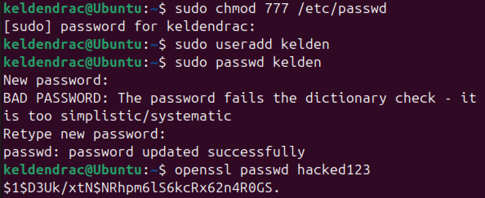
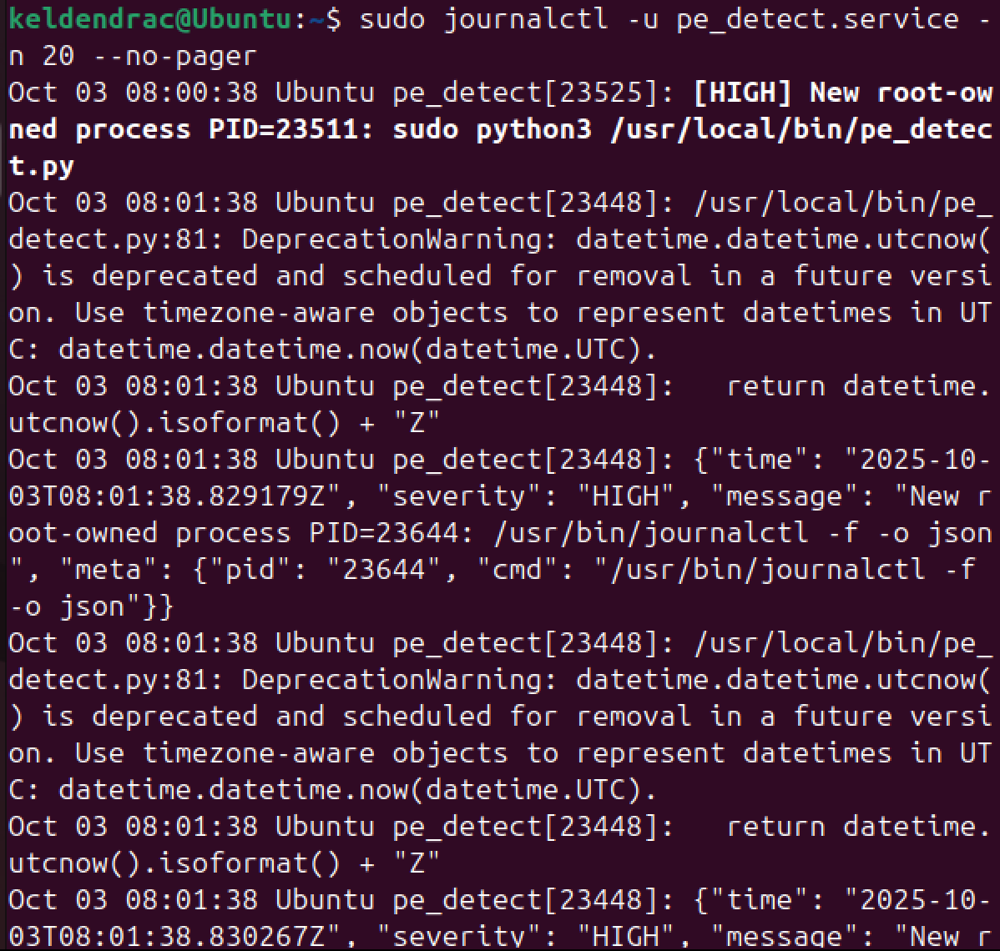
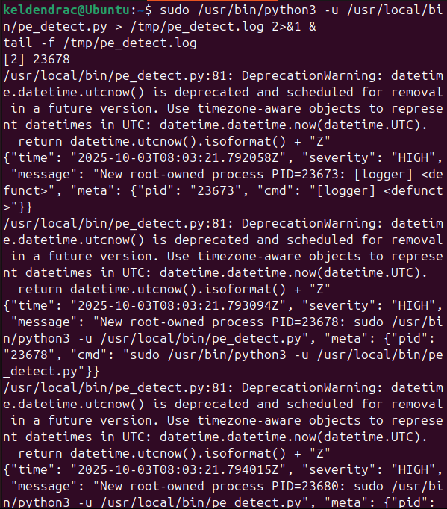
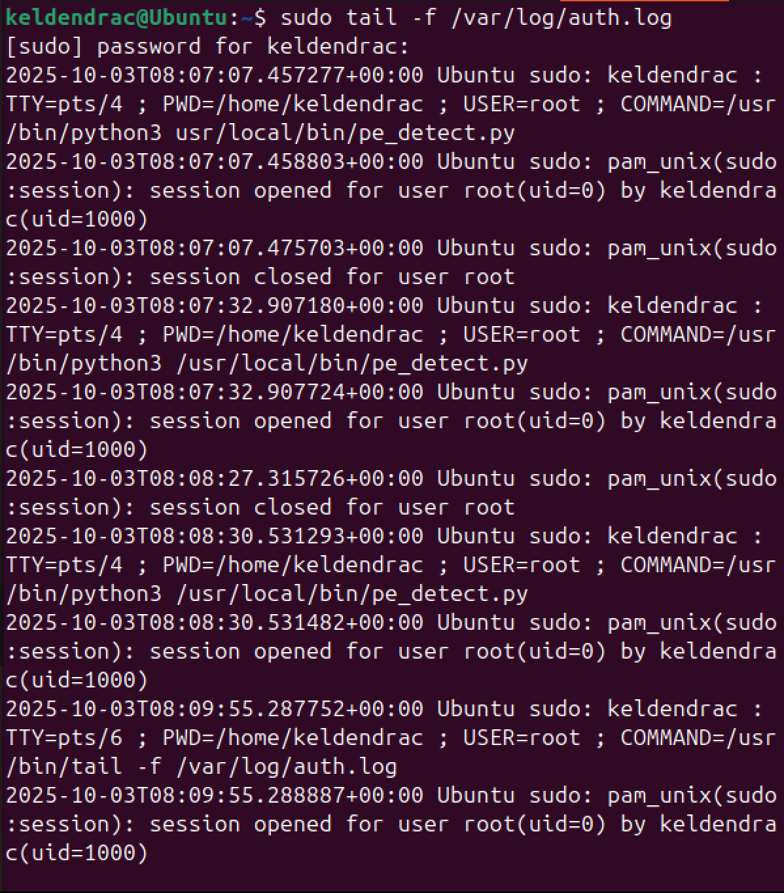
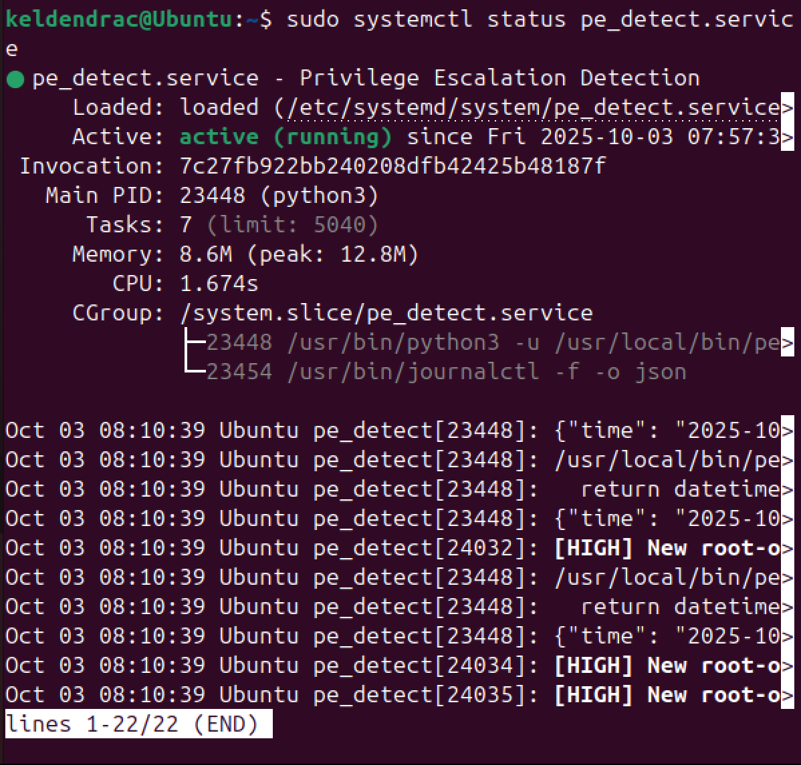
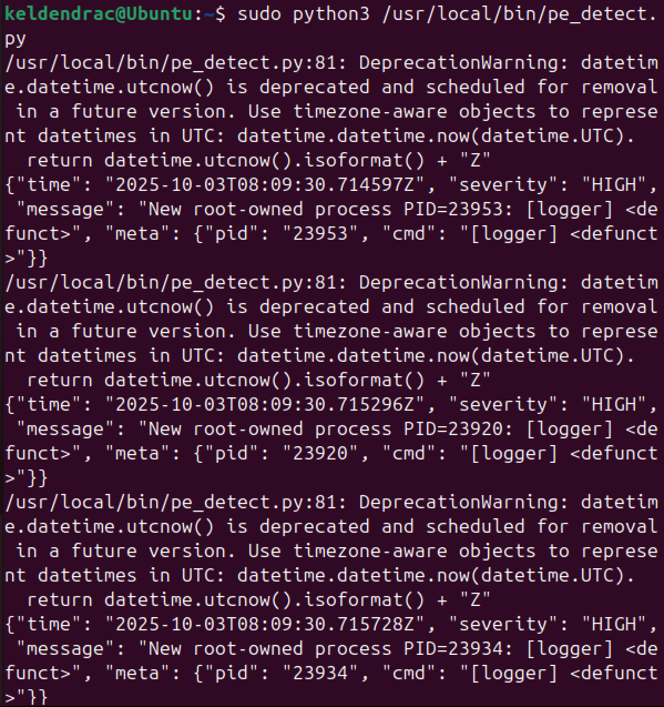

# Linux Security Monitoring: A Comparative Analysis of Log Management Tools

[](https://github.com/)
[](https://www.linux.org/)
[](https://systemd.io/)

## 📋 Project Overview

This repository contains a comprehensive security analysis conducted as part of the SWS303 Foundational Security Operations coursework. The research examined various Linux log monitoring methodologies through practical implementation and comparative testing of security monitoring tools during simulated privilege escalation scenarios.

### 🎯 Research Focus

The investigation centered on evaluating four distinct approaches to Linux system monitoring:
- SystemD service status verification (`systemctl`)
- Real-time script execution monitoring
- Traditional log file tracking (`tail -f`)
- Advanced journal analysis (`journalctl`)

## 🔬 Experimental Design

### Test Environment Architecture

The experimental setup utilized a controlled Linux environment featuring:
- Modern systemd-enabled distribution
- Custom privilege escalation detection service (`pe_detect.service`)
- Python-based security monitoring scripts
- Integrated logging infrastructure

### Security Event Simulation

To generate authentic security events for analysis, a controlled privilege escalation attack was orchestrated:

1. **Vulnerability Introduction**: Permissions on `/etc/passwd` were intentionally misconfigured to 777
2. **Attack Vector Preparation**: Test user accounts were established with known credentials
3. **Privilege Escalation Execution**: Root password hash replacement was performed
4. **Monitoring Validation**: Each monitoring tool captured the security events for analysis

## 📊 Methodology Comparison

### Tool Performance Matrix

| Monitoring Approach | Real-time Capability | Historical Access | Filtering Power | System Integration | Learning Curve |
|-------------------|---------------------|------------------|----------------|-------------------|---------------|
| `systemctl status` | Limited | Basic | Minimal | Excellent | Low |
| Direct Execution | Excellent | None | None | Poor | Minimal |
| `tail -f` | Excellent | None | Basic | Good | Low |
| `journalctl` | Excellent | Comprehensive | Advanced | Excellent | Moderate |

## 🔍 Key Findings

### Monitoring Tool Effectiveness

The research revealed that each monitoring approach demonstrated unique strengths:

**SystemD Status Monitoring** proved most effective for rapid health assessments and immediate service validation. The tool provided consolidated views of service performance alongside recent security events.

**Direct Script Execution** offered unparalleled real-time visibility during security event development. This approach enabled immediate correlation between attack progression and detection mechanisms.

**Traditional Log Monitoring** using `tail -f` maintained its relevance for security correlation, particularly when connecting detection alerts with authentic system authentication events.

**Journal Analysis** through `journalctl` demonstrated superior capabilities for post-incident investigation, offering advanced filtering and comprehensive historical access.

## 📈 Practical Applications

### Security Operations Integration

The study identified optimal use cases for each monitoring methodology:

- **Immediate Response**: Direct execution monitoring for active incident response
- **Health Verification**: SystemD status for routine security service validation  
- **Event Correlation**: Traditional log monitoring for connecting security alerts with system events
- **Forensic Investigation**: Journal analysis for comprehensive incident reconstruction

### Recommended Implementation Strategy

Based on the experimental results, a layered monitoring approach was determined to provide optimal security coverage:

1. Deploy multiple monitoring methods simultaneously
2. Utilize appropriate tools based on operational requirements
3. Implement correlation mechanisms between different log sources
4. Maintain redundant monitoring for critical security events

## 🛡️ Security Implications

### Vulnerability Analysis

The research demonstrated critical security risks associated with file permission misconfigurations. The `/etc/passwd` attack vector highlighted the importance of:

- Proper file permission management (644 instead of 777)
- Regular security auditing procedures
- Implementation of file integrity monitoring systems
- Restricted privilege escalation pathways

### Mitigation Strategies

The study identified essential security controls:
- File permission auditing using `ls -l /etc/passwd`
- Authentication log monitoring via `/var/log/auth.log`
- File integrity systems deployment (`aide`, `tripwire`)
- Sudoers configuration for privilege restriction

## 📸 Visual Evidence & Screenshots

The following images provide comprehensive documentation of the security analysis process and monitoring tool outputs:

### User Account Preparation

*Figure 1: User account creation and password hash generation procedures*

### Advanced Journal Analysis

*Figure 2: SystemD journal analysis demonstrating advanced filtering capabilities*

### Traditional Log File Monitoring

*Figure 3: Real-time authentication log monitoring using tail command*

### Continued Log Monitoring

*Figure 4: Continued log monitoring showing privilege escalation events*

### SystemD Service Monitoring

*Figure 5: SystemD service status display during privilege escalation detection*

### Real-time Script Execution

*Figure 6: Direct script execution monitoring with live security event detection*

Each screenshot demonstrates the unique capabilities and output formats of the different monitoring approaches, providing visual evidence of how each tool captured and presented the simulated security events during the controlled privilege escalation scenario.

## 🔧 Technical Implementation

### Service Configuration

The detection service was implemented with:
- JSON-formatted output for structured analysis
- SystemD integration for automatic management
- Dual output to console and system logging
- Real-time privilege escalation monitoring

### Command Reference

Essential commands utilized during the analysis:
```bash
# Service status verification
sudo systemctl status pe_detect.service

# Real-time log monitoring  
sudo tail -f /var/log/auth.log

# Journal analysis
sudo journalctl -u pe_detect.service -n 20 --no-pager

# Permission correction
sudo chmod 644 /etc/passwd && sudo chown root:root /etc/passwd
```

## 📚 Academic Context

This research was conducted as Practical 2 for SWS303 - Foundational Security Operations, demonstrating the practical application of security monitoring concepts in controlled Linux environments. The study bridged theoretical cybersecurity knowledge with hands-on security operations experience.

## 🎓 Learning Outcomes

The investigation successfully demonstrated:
- Comprehensive understanding of Linux logging architecture
- Practical security monitoring implementation skills
- Incident response technique application
- Multi-tool comparative analysis capabilities
- Professional security documentation practices

*This repository represents original academic work demonstrating practical cybersecurity skills through controlled security scenario analysis and comparative tool evaluation.*